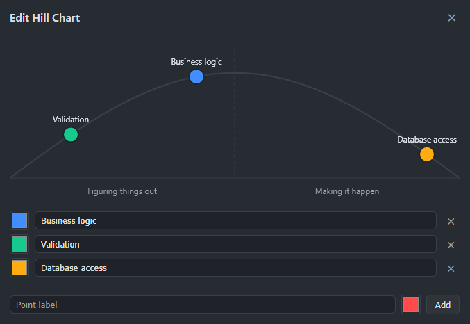
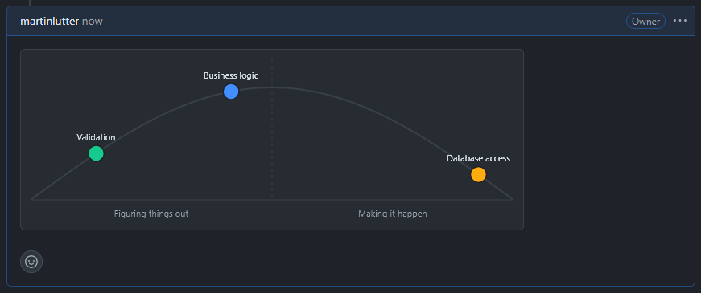

# Hill Chart for GitHub

A browser extension that adds interactive [Basecamp-style Hill Charts](https://basecamp.com/hill-charts) to GitHub issues. Track where work stands — no tokens, no setup, just install and go.

<p align="left">
  
</p>

## How It Works

1. Open any GitHub issue and click the **Hill Chart** button in the issue toolbar
2. Add points representing tasks or workstreams
3. Drag points along the hill to show progress
4. Hit **Paste to comment** — the chart data is pasted into the issue's comment form and is ready to be submitted

Data is saved directly through GitHub's comment form (no API token required). Chart data lives inside the issue itself as a `` ```hillchart `` code block, so it travels with the issue and doesn't depend on any external service.

**Left side** = "Figuring things out" (uncertainty, research, design)  
**Right side** = "Making it happen" (execution, known work)

<p align="left">
  
</p>

## Install

### Chrome

1. Download the release file (and extract) or `npm install && npm run build`
2. Open `chrome://extensions`, enable Developer Mode
3. Click "Load unpacked" and select the `dist/` folder

### Firefox

1. Download the release file or `npm install && npm run build:firefox`
2. Open `about:debugging#/runtime/this-firefox`
3. Click "Load Temporary Add-on" and select any file in `dist-firefox/`

## Development

```sh
npm run dev          # Build with watch mode
npm run test:unit    # Vitest unit tests
npm run test:e2e     # Playwright end-to-end tests (builds first)
npm run typecheck    # TypeScript type checking
npm run lint         # ESLint
```

## Tech Stack

- **Extension**: Chrome MV3 + Firefox MV2, content script in Shadow DOM for style isolation
- **UI**: React 19, TypeScript, custom SVG hill chart (no D3)
- **Build**: Vite + @crxjs/vite-plugin
- **Tests**: Vitest + React Testing Library (unit), Playwright (E2E)
